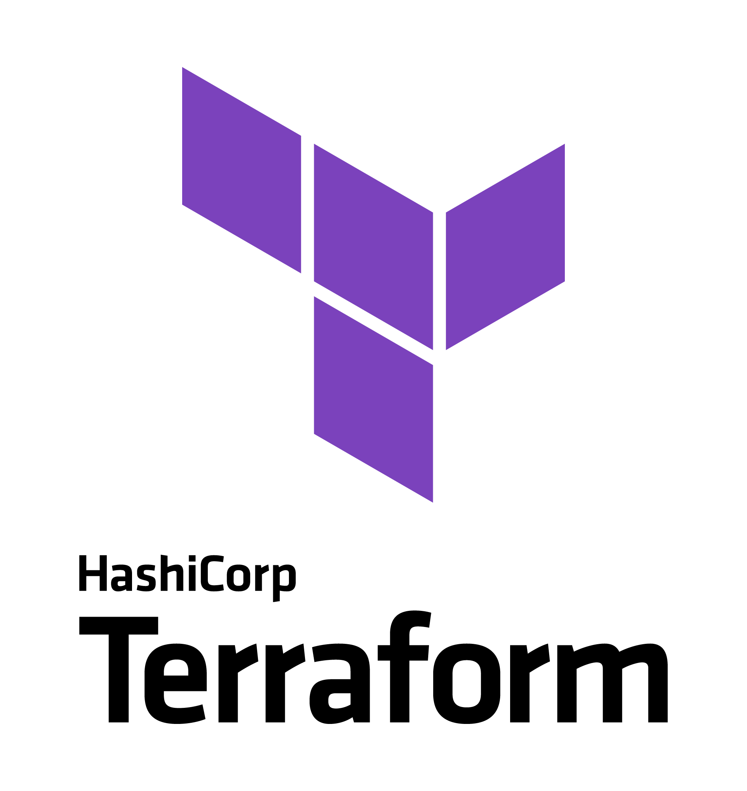

# Terraform stacks

Terraform stacks intended to help in CREs tickets resolution and PoCs.

## Prerequisites
* [Terraform 0.13+](https://developer.hashicorp.com/terraform/downloads) Tool that manages IaC (infrastructure-as-code) in diverse public cloud providers and tools.
* [terraform-docs](https://github.com/terraform-docs/terraform-docs/releases/) Generate documentation for Terraform stacks.
* [tflint](https://github.com/terraform-linters/tflint) Linter for Terraform stacks. Linting rules for diverse public providers.
* [pre-commit](https://pre-commit.com/) A framework for managing and maintaining multi-language pre-commit hooks.

## Stacks
* [Bootstrap](./bootstrap/README.md) Bootstrap stack to activate APIs in GCP sandbox and maintain Terraform state files

## PoCs
* [GKE Gateway](./pocs/gke-gateway/README.md) Terraform stack to deploy internal Gateways on GKE.

## Tickets
* [#93289](./tickets/%2393289/baseline/README.md) 